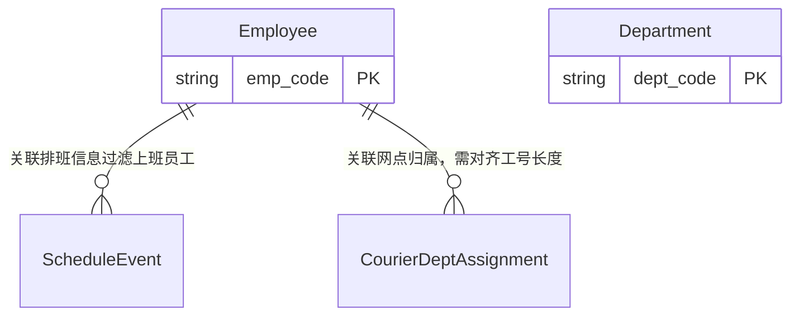
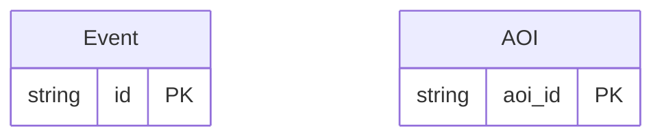

# Data Agent 可视化知识库

> **自动生成时间**: 2026-06-02 11:06:54
> **说明**: 本文档由脚本自动从 `knowledge/domains/*.json` 聚合生成。**JSON 用于 AI 执行，本 MD 用于人工审计。**

---

## 目录
- [骑手工服合规检查](#业务域骑手工服合规检查)
- [场景监控-重点事件](#业务域场景监控-重点事件)

---

## 业务域：骑手工服合规检查
- **ID**: `courier_compliance`
- **描述**: 关注一线在职员工的排班、归属网点、资源池/资源标签等合规性检查

### 1. 关系拓扑图 (Relationship Map)

### 2. 核心实体 (Entities)
| 实体名 | 主键 | 物理来源 | 描述 |
| :--- | :--- | :--- | :--- |
| Employee | `emp_code` | `[TABLE_REMOVED]` | 员工实体, 仅关注一线且在职的员工 |
| CourierDeptAssignment | `-` | `[TABLE_REMOVED]` | 骑手与网点的归属关系表 |
| Department | `dept_code` | `[TABLE_REMOVED]` | 智域网点实体 |

### 3. 指标口径 (Metrics)
| 指标名称 | 计算表达式 | 过滤条件 | 单位 |
| :--- | :--- | :--- | :--- |
| 排班上班骑手数 | `COUNT(DISTINCT emp_code)` | `on_duty_status = '1'` | 人 |
| 合规检查覆盖人数 | `COUNT(DISTINCT emp_code)` | `-` | 人 |

### 4. 计算链路 (Computation Chains)
| 复合指标 | 业务定义 | 计算步骤 | 预警阈值 |
| :--- | :--- | :--- | :--- |
| 合规上班率 | 实际参加合规检查的上班人数 / 应上班总人数 | `active_couriers -> coverage_count -> DIVIDE` | 低于 95% 需预警 |

### 5. 派生属性/转换规则
| 属性名 | 逻辑说明 | 枚举值 |
| :--- | :--- | :--- |
| ResourcePool | CASE WHEN resource_flag IN ('自有全职', '自有非全') THEN '自有' ELSE resource_flag END | 自有, 同城骑手, 乡镇合伙人, 城市合伙人 |
| ResourceFlag | 根据 emp_source, peak, emp_group_txt 等字段组合派生 |  |

---

## 业务域：场景监控-重点事件
- **ID**: `event_monitoring`
- **描述**: 演唱会、短期出行、地区节假日等重点场景监控

### 1. 关系拓扑图 (Relationship Map)

### 2. 核心实体 (Entities)
| 实体名 | 主键 | 物理来源 | 描述 |
| :--- | :--- | :--- | :--- |
| Event | `id` | `-` |  |
| AOI | `aoi_id` | `[TABLE_REMOVED]` |  |

### 3. 指标口径 (Metrics)
| 指标名称 | 计算表达式 | 过滤条件 | 单位 |
| :--- | :--- | :--- | :--- |
| 活跃事件数 | `COUNT(DISTINCT id)` | `event_status = '1'` | - |

---
