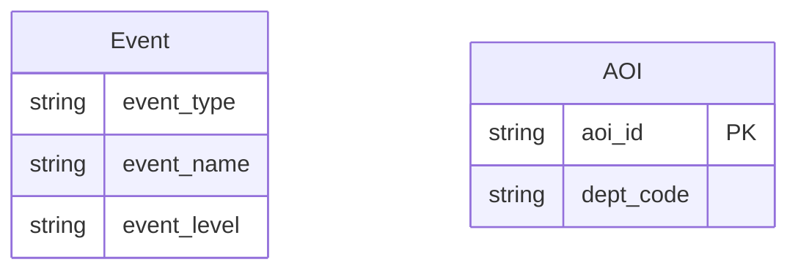

# Data Agent 可视化知识库（本体模型）

> **自动生成时间**: 2026-06-02 20:25:39
> **说明**: 本文档由脚本自动从 `knowledge/domains/*.json` 聚合生成。**JSON 用于 AI 执行，本 MD 用于人工审计。**

---

## 目录
- [骑手工服合规检查](#业务域骑手工服合规检查)
- [场景监控-重点事件](#业务域场景监控-重点事件)
- [同城-骑手散单运营](#业务域同城-骑手散单运营)

---

## 业务域：骑手工服合规检查
- **ID**: `courier_compliance`
- **描述**: 关注一线在职员工的排班、归属网点、资源池/资源标签等合规性检查
- **版本**: 2.0.0

### 1. 关系拓扑图 (Relationship Map)
```mermaid
erDiagram
    Employee {
        string emp_code PK
        string emp_name NOT-NULL
        string emp_source
        string position_attribute
        string peak
        string employ_status
    }
    CourierDeptAssignment {
        string login_id PK
        string login_name
        string org_dept_code
        string service_dept
        integer job_status
        integer is_deleted
        string update_time
        string system_ownership
    }
    Department {
        string dept_code PK
        string dept_name
        string area_code
        string area_name
        string hq_code
        string hq_name
    }
    ScheduleEvent {
        string emp_code
        string inc_day
        string on_duty_status
        string dept_code
        string day
    }
    ComplianceResult {
        string emp_code PK
        string emp_name
        string emp_source
        string position_attribute
        string peak
        string emp_group_name
        string employ_status
        string dept_code
        string area_code
        string resource_flag
        string resource_pool_type
        string inc_day
    }
    Employee ||--o{ ScheduleEvent : "员工关联排班信息，一个员工每日一条排班记录"
    Employee ||--|| CourierDeptAssignment : "员工归属唯一网点，需工号补齐8位关联"
    CourierDeptAssignment }o--|| Department : "网点归属映射到智域网点实体"
    ScheduleEvent ||--|| ComplianceResult : "排班上班员工参与合规检查，结果一一对应"
```

### 2. 核心实体 (Entities)
| 实体名 | 主键 | 属性数 | 物理来源 | 描述 |
| :--- | :--- | :--- | :--- | :--- |
| Employee | `emp_code` | 6 | `[TABLE_REMOVED]` | 员工实体，仅关注一线且在职的员工 |
| CourierDeptAssignment | `login_id` | 8 | `[TABLE_REMOVED]` | 骑手与网点的归属关系表 |
| Department | `dept_code` | 6 | `[TABLE_REMOVED]` | 智域网点实体 |
| ScheduleEvent | `id` | 5 | `[TABLE_REMOVED]` | 排班事件，记录每日骑手排班状态 |
| ComplianceResult | `emp_code` | 12 | `tmp_[TABLE_REMOVED]` | 合规检查结果聚合实体 |

### 3. 层级分类 (Hierarchy)
**ResourcePoolType**
- **SelfEmployed**: 自有资源池
  - 规则: `resource_flag IN ('自有全职', '自有非全')`
- **FullTime**: 自有全职
  - 规则: `emp_source='HR' AND employ_status='在职' AND position_attribute='一线' AND peak='否' AND emp_group_txt='全日制用工'`
- **PartTime**: 自有非全
  - 规则: `emp_source='HR' AND employ_status='在职' AND position_attribute='一线' AND peak='否' AND emp_group_txt='非全日制用工'`
- **CityRider**: 同城骑手
  - 规则: `emp_source='OA' AND employ_status='在职' AND position_attribute='一线' AND position_txt='delivery'`
- **TownshipPartner**: 乡镇合伙人
  - 规则: `emp_source='OA' AND employ_status='在职' AND position_attribute='一线' AND bus_mode='422-区域代理'`
- **CityPartner**: 城市合伙人
  - 规则: `emp_source='OA' AND employ_status='在职' AND position_attribute='一线' AND bus_mode='414-标准收派'`

**ScheduleStatus**
- **OnDuty**: 上班
  - 规则: `on_duty_status = '1'`
- **OffDuty**: 轮休
  - 规则: `on_duty_status = '0'`

### 4. 指标口径 (Metrics)
| 指标名称 | 定义 | 计算式 | 过滤条件 | 单位 | 预警阈值 |
| :--- | :--- | :--- | :--- | :--- | :--- |
| 排班上班骑手数 | 当日排班状态为上班的骑手总数 | `COUNT(DISTINCT emp_code)` | `on_duty_status = '1'` | 人 | - |
| 合规检查覆盖人数 | 实际参加合规检查的骑手总数 | `COUNT(DISTINCT emp_code)` | `-` | 人 | - |
| 合规上班率 | 实际参加合规检查的上班人数 / 应上班总人数 | `coverage_count * 100.0 / active_couriers` | `-` | % | 低于 95% 需预警 |
| 各资源池人数 | 按资源池类型分组的骑手数 | `COUNT(DISTINCT emp_code)` | `-` | 人 | - |

### 5. 计算链路 (Computation Chains)
| 复合指标 | 业务定义 | 计算步骤 | 预警阈值 |
| :--- | :--- | :--- | :--- |
| 合规上班率 | 实际参加合规检查的上班人数 / 应上班总人数 | `active_couriers -> coverage_count -> compliance_rate` | 低于 95% 需预警 |

### 6. 领域公理 (Axioms)
| 编号 | 公理描述 | 形式化表达 |
| :--- | :--- | :--- |
| AX-001 | 每个排班记录必然关联且仅关联一个员工 | `forall s in ScheduleEvent, exists! e in Employee: s.emp_code = e.emp_code` |
| AX-002 | 员工在同一分区中只属于一个网点 | `forall e in Employee, forall d1,d2 in CourierDeptAssignment: (e.emp_code=d1.login_id AND e.emp_code=d2.login_id) -> d1.org_dept_code = d2.org_dept_code` |
| AX-003 | 资源池类型互斥：一个员工在同一时刻只能属于一种资源池 | `forall e in Employee, forall r1,r2 in ResourcePoolType: ResourceOf(e)=r1 AND ResourceOf(e)=r2 -> r1 = r2` |
| AX-004 | 合规检查结果中的员工必然当天排班为上班 | `forall c in ComplianceResult, exists s in ScheduleEvent: c.emp_code = s.emp_code AND s.on_duty_status = '1'` |

### 7. 业务规则 (Business Rules)
| 规则名 | 内容 |
| :--- | :--- |
| 上班合规性 | 只有排班状态为'上班'的骑手才会有合规检查数据，轮休骑手不应出现在合规检查结果中 |
| 工号补齐规则 | 所有 emp_code 参与关联时必须使用 lpad 补齐至 8 位，防止因工号长度不一致导致关联丢失 |
| 高峰期约束 | peak 字段为'是'时，对应的 resource_pool_type 必须包含'高峰用工'标签 |
| 资源池互斥 | 一个骑手在同一日期只能属于一个资源池类型，resource_pool_type 取值互斥 |
| 在职约束 | 合规检查仅针对 employ_status='在职' 且 is_deleted=0 的员工 |

### 8. 分区与过滤规则 (Filter Rules)
| 规则名 | 说明 | 条件 |
| :--- | :--- | :--- |
| employee_filter | 员工基表过滤：仅一线在职员工 | `position_attribute = '一线' AND employ_status = '在职'` |
| schedule_partition | 排班表取T-1分区 | `inc_day = '$[time(yyyyMMdd,-1d)]'` |
| courier_dept_dedup | 骑手维度表去重规则：按login_id分组取update_time最新 | `job_status = 1 AND is_deleted = 0 AND row_number() over(partition by login_id order by update_time desc) = 1` |

---

## 业务域：场景监控-重点事件
- **ID**: `event_monitoring`
- **描述**: 演唱会、短期出行、地区节假日等重点场景监控
- **版本**: 1.0.0

### 1. 关系拓扑图 (Relationship Map)


### 2. 核心实体 (Entities)
| 实体名 | 主键 | 属性数 | 物理来源 | 描述 |
| :--- | :--- | :--- | :--- | :--- |
| Event | `id` | 3 | `-` |  |
| AOI | `aoi_id` | 2 | `[TABLE_REMOVED]` |  |

### 4. 指标口径 (Metrics)
| 指标名称 | 定义 | 计算式 | 过滤条件 | 单位 | 预警阈值 |
| :--- | :--- | :--- | :--- | :--- | :--- |
| 活跃事件数 | - | `COUNT(DISTINCT id)` | `event_status = '1'` | - | - |

---

## 业务域：同城-骑手散单运营
- **ID**: `rider_casual_operation`
- **描述**: 同城骑手散单承接体量分析领域，用于骑手分层运营策略和收件权限管控
- **版本**: 1.0.0

### 1. 关系拓扑图 (Relationship Map)
```mermaid
erDiagram
    Rider {
        string emp_code PK
        string emp_name NOT-NULL
        string area_code
        string area_name
        integer rider_level
    }
    Department {
        string login_id PK
        string org_dept_code
        integer job_status
        integer is_deleted
        string update_time
    }
    AOIAssignment {
        string emp_code
        string aoi_area_id
        tinyint status
    }
    Waybill {
        string waybill_no PK
        string emp_code
        string dept_code
        string area_code
        string freight_monthly_acct_code
        string layer_name
        string inc_day
    }
    MonthlyCustomer {
        string customer_code PK
        string cust_tier_label
        string billing_status
    }
    SandStat {
        string emp_code PK
        string area_code
        string area_name
        string org_dept_code
        string service_area
        string emp_name
        bigint pure_casual_cnt
        bigint monthly_casual_cnt
        string inc_day
    }
    Rider ||--|| Department : "骑手归属唯一网点（去重取最新记录）"
    Rider ||--o{ AOIAssignment : "骑手可配置多个AOI服务区域"
    Rider ||--o{ PickupWaybill : "骑手在4月可有多条收件运单"
    Rider ||--o{ DeliverWaybill : "骑手在4月可有多条派件运单"
    Waybill }o--|| MonthlyCustomer : "运单通过月结卡号关联月结客户标签"
    Rider ||--|| SandStat : "统计结果与骑手一一对应"
```

### 2. 核心实体 (Entities)
| 实体名 | 主键 | 属性数 | 物理来源 | 描述 |
| :--- | :--- | :--- | :--- | :--- |
| Rider | `emp_code` | 5 | `[TABLE_REMOVED]` | 同城骑手实体，代表参与同城配送的收派员 |
| Department | `login_id` | 5 | `[TABLE_REMOVED]` | 骑手网点归属关系，记录骑手与组织网点的映射 |
| AOIAssignment | `id` | 3 | `[TABLE_REMOVED]` | 骑手AOI服务区域配置，记录骑手常驻的配送区域 |
| Waybill | `waybill_no` | 7 | `[TABLE_REMOVED] | [TABLE_REMOVED]` | 运单实体，收件或派件的完整运单信息 |
| MonthlyCustomer | `customer_code` | 3 | `dm_crm.dm_customer_allcust_info_df` | 月结客户实体，记录月结客群的标签分层 |
| SandStat | `emp_code` | 9 | `tmp_[TABLE_REMOVED]` | 骑手散单统计聚合实体，为业务分析结果表 |

### 3. 层级分类 (Hierarchy)
**Waybill**
- **PickupWaybill**: 收件运单，emp_code为揽收骑手
- **DeliverWaybill**: 派件运单，emp_code为派送骑手

**SandType**
- **PureSand**: 纯散件：运单layer_name为空，无任何客户分层标签
  - 规则: `layer_name IS NULL`
- **MonthlyCasual**: 月结散件：运单月结卡号匹配月结客户表且cust_tier_label在1.1~2.2范围
  - 规则: `freight_monthly_acct_code IN (SELECT customer_code FROM MonthlyCustomer WHERE cust_tier_label IN ('1.1','1.2','1.3','2.1','2.2'))`
- **NonSand**: 非散件：layer_name非空且不匹配月结客群标签
  - 规则: `layer_name IS NOT NULL AND 不匹配月结客群`

### 4. 指标口径 (Metrics)
| 指标名称 | 定义 | 计算式 | 过滤条件 | 单位 | 预警阈值 |
| :--- | :--- | :--- | :--- | :--- | :--- |
| 纯散件总数 | 骑手在4月收派件中layer_name为空的运单总数 | `COUNT(CASE WHEN layer_name IS NULL THEN 1 END)` | `inc_day BETWEEN '20260401' AND '20260430'` | 件 | - |
| 月结散件总数 | 骑手在4月收派件中月结卡号匹配月结客户表且月结标签在1.1~2.2的运单总数 | `COUNT(CASE WHEN monthly_customer.customer_code IS NOT NULL THEN 1 END)` | `inc_day BETWEEN '20260401' AND '20260430'` | 件 | - |
| 散单骑手占比 | 有散单数据的骑手数 / 骑手基表总数 | `COUNT(CASE WHEN pure_casual_cnt + monthly_casual_cnt > 0 THEN 1 END) * 100.0 / COUNT(DISTINCT emp_code)` | `-` | % | 低于10%需人工复核 |

### 5. 计算链路 (Computation Chains)
| 复合指标 | 业务定义 | 计算步骤 | 预警阈值 |
| :--- | :--- | :--- | :--- |
| total_casual_stat | 骑手散单总量计算链路 | `pure_casual_pickup -> pure_casual_deliver -> pure_casual_cnt -> monthly_casual_pickup -> monthly_casual_deliver -> monthly_casual_cnt` | - |

### 6. 领域公理 (Axioms)
| 编号 | 公理描述 | 形式化表达 |
| :--- | :--- | :--- |
| AX-001 | 每个运单必然关联且仅关联一个骑手 | `∀w ∈ Waybill, ∃!k ∈ Rider: w.emp_code = k.emp_code` |
| AX-002 | 骑手在同一分区中只属于一个网点 | `∀k ∈ Rider, ∀d1,d2 ∈ Department: (k.emp_code=d1.login_id ∧ k.emp_code=d2.login_id) → d1.org_dept_code = d2.org_dept_code` |
| AX-003 | 散单分类互斥：一条运单只能是纯散、月结散、非散中的一种 | `∀w ∈ Waybill: PureSand(w) XOR MonthlyCasual(w) XOR NonSand(w)` |
| AX-004 | 统计结果中的散单计数非负 | `∀s ∈ SandStat: s.pure_casual_cnt ≥ 0 ∧ s.monthly_casual_cnt ≥ 0` |

### 7. 业务规则 (Business Rules)
| 规则名 | 内容 |
| :--- | :--- |
| 纯散件定义 | 运单layer_name为NULL，表示下单手机号或月结卡号在销售系统中无任何客户分层标签 |
| 月结散件定义 | 运单freight_monthly_acct_code匹配月结客户表，且月结客户cust_tier_label在('1.1','1.2','1.3','2.1','2.2')范围内 |
| 网点映射规则 | 骑手网点通过dim_rider_org_id取login_id匹配emp_code，过滤在职且未删除，按update_time降序取最新一条 |
| 服务区域聚合规则 | 骑手AOI区域按emp_code分组，collect_set去重后concat_ws逗号拼接，仅取status=1生效配置 |
| 收件权限约束 | 仅高级骑手(rider_level=4)可接收全部类型散单，中级及以下不得收取纯散和月结散类型的下沉单 |

### 8. 分区与过滤规则 (Filter Rules)
| 规则名 | 说明 | 条件 |
| :--- | :--- | :--- |
| monthly_customer_label | 月结客户标签有效值枚举 | `-` |
| rider_period | 骑手基表固定取202604月度分区 | `inc_day='202604'` |
| waybill_period | 运单取4月全量（0401~0430） | `inc_day BETWEEN '20260401' AND '20260430'` |
| courier_dept | 骑手维度表取T-1分区，在职且未删除 | `inc_day='$[time(yyyyMMdd,-1d)]' AND job_status=1 AND is_deleted=0 AND row_number() over(partition by login_id order by update_time desc) = 1` |
| aoi_config | AOI分组取T-1分区生效配置 | `inc_day='$[time(yyyyMMdd,-1d)]' AND status=1` |

---
