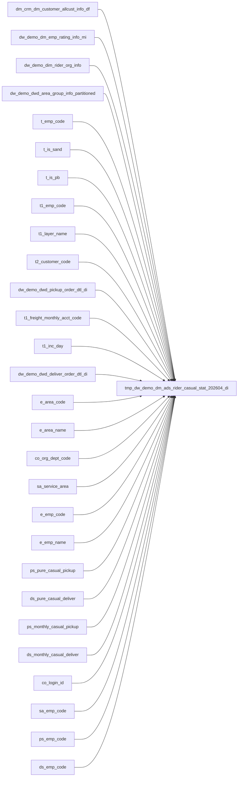

# 同城-同城骑手4月散单数据明细 - 设计文档

## 一、需求概述

- **需求目标**: 统计每位同城骑手在2026年4月份的纯散件和月结散件收派件总量
- **业务背景**: 为推进同城散单数据取数与骑手分层运营策略落地，核心聚焦高级骑手专属收件权限实施，明确需通过数据分析识别各骑手纯散单与月结散单量级，作为后续权限限制依据。仅高级骑手可接收全部类型散单（含下靠散单），中级及以下等级骑手不得收取纯散和月结散类型的下沉单。

## 二、取数逻辑

1. **骑手基表**: 从 `dm_emp_rating_info_mi` 取 `inc_day='202604'` 分区，获取 `emp_code/emp_name/area_code/area_name`
2. **网点编码**: 从 `dim_rider_org_info` 取 `org_dept_code`，筛选条件 `job_status=1`（在职）、`is_deleted=0`，按 `update_time` 降序取最新去重
3. **服务区域**: 从 `dwd_area_group_info_partitioned` 按骑手 `emp_code` 聚合 `aoi_area_id`，逗号拼接输出
4. **收件散单识别**:
   - 纯散件: 收件宽表4月全量中 `layer_name` 为空的运单数（按 `emp_code` 汇总）
   - 月结散件: 收件宽表中 `freight_monthly_acct_code` 匹配月结客户表且 `cust_tier_label` 在 `1.1~1.3/2.1~2.2` 的运单数
5. **派件散单识别**: 同收件逻辑，使用派件宽表
6. **最终指标**: `pure_casual_cnt=纯散收件+纯散派件`, `monthly_casual_cnt=月结散收件+月结散派件`

## 三、映射关系

| 映射关系 | 关联字段 | 说明 |
|----------|---------|------|
| 骑手→网点 | `emp_code = login_id` | 骑手维度表，去重取最新 |
| 骑手→服务区域 | `emp_code = emp_code` | AOI分组表，`concat_ws` 聚合 `aoi_area_id` |
| 运单→月结标签 | `freight_monthly_acct_code = customer_code` | 月结客户表 |
| 纯散件判断 | `layer_name IS NULL` | 运单打标表 |
| 月结散件判断 | `cust_tier_label IN ('1.1','1.2','1.3','2.1','2.2')` | 月结客户表 |

## 四、目标表结构

- **表名**: `tmp_dw_demo.dm_ads_rider_casual_stat_202604_di`
- **分区**: `inc_day` string (格式 `YYYYMMDD`)

| 字段名 | 类型 | 注释 |
|--------|------|------|
| area_code | string | 地区编码 |
| area_name | string | 地区名称 |
| org_dept_code | string | 所属网点编码 |
| service_area | string | 所属服务区域(AOI区域编码逗号拼接) |
| emp_code | string | 骑手工号 |
| emp_name | string | 骑手姓名 |
| pure_casual_cnt | bigint | 纯散件总数(4月收派件合计) |
| monthly_casual_cnt | bigint | 月结散件总数(4月收派件合计) |

## 五、数据来源与关联关系

1. **dw_demo.dm_emp_rating_info_mi**（骑手分级标签）
   - 分区: `inc_day='202604'`
   - 用途: 骑手基表，获取地区信息和骑手姓名

2. **dw_demo.dim_rider_org_info**（骑手维度表）
   - 分区: `inc_day='$[time(yyyyMMdd,-1d)]'`
   - 过滤: `job_status=1 AND is_deleted=0`
   - 去重: 按 `login_id` 分组，`update_time` 降序取第一条
   - 用途: 获取所属网点编码 `org_dept_code`

3. **dw_demo.dwd_area_group_info_partitioned**（AOI分组信息表）
   - 分区: `inc_day='$[time(yyyyMMdd,-1d)]'`
   - 过滤: `status=1`
   - 用途: 获取骑手配置的服务区域（`aoi_area_id` 聚合）

4. **dw_demo.dwd_pickup_order_dtl_di**（运单打标-收件宽表）
   - 分区: `inc_day>='20260401' AND inc_day<='20260430'`
   - 用途: 4月收件运单，识别纯散/月结散件

5. **dw_demo.dwd_deliver_order_dtl_di**（运单打标-派件宽表）
   - 分区: `inc_day>='20260401' AND inc_day<='20260430'`
   - 用途: 4月派件运单，识别纯散/月结散件

6. **dm_crm.dm_customer_allcust_info_df**（月结客户名单表）
   - 分区: `max(inc_day)`
   - 过滤: `cust_tier_label IN ('1.1','1.2','1.3','2.1','2.2')`
   - 用途: 识别月结散件对应的月结客户

**关联方式**: `emp_base(emp_code)` left join 各维度表

## 六、调度配置

- **调度频率**: 一次性需求（4月数据统计），非日常调度
- **分区变量**: `inc_day = $[time(yyyyMMdd,-1d)]`
- **失败策略**: 告警通知 + 重试

## 七、数据质量保障

详见 `数据质量测试.sql`，共10个用例。

## 八、上下游依赖

**上游**:
- `dw_demo.dm_emp_rating_info_mi` (`inc_day='202604'`)
- `dw_demo.dim_rider_org_info` (`inc_day='$[time(yyyyMMdd,-1d)]'`)
- `dw_demo.dwd_area_group_info_partitioned` (`inc_day='$[time(yyyyMMdd,-1d)]'`)
- `dw_demo.dwd_pickup_order_dtl_di` (inc_day 4月全量)
- `dw_demo.dwd_deliver_order_dtl_di` (inc_day 4月全量)
- `dm_crm.dm_customer_allcust_info_df` (max inc_day)

**下游**:
- 骑手分层运营策略（收件权限管控）
- BI报表/数据分析

## 九、文件清单

| 文件 | 用途 |
|------|------|
| 表结构.sql | 目标表DDL |
| 同城-同城骑手4月散单数据明细.sql | 核心ETL逻辑 |
| 数据质量测试.sql | DQC测试用例 |
| Design.md | 本设计文档 |
| 交付总报告.md | 交付总报告 |
| 知识沉淀.md | 知识沉淀文档 |

## 十、资源成本预估 (Cost Estimation)

### 资源成本预估报告
- **分析对象**: `同城-同城骑手4月散单数据明细.sql`
- **来源表数量**: 29
- **风险评估**:
  - ⚠️ 中风险: 关联表数量较多 (29 张)，请关注执行计划性能。
- **预估扫描量**: 约 500GB - 2TB (基于上游表历史日增量预估)
- **资源预警级别**: 🔴 高

## 十一、数据血缘联动 (Lineage)

### 1. 表级血缘图

